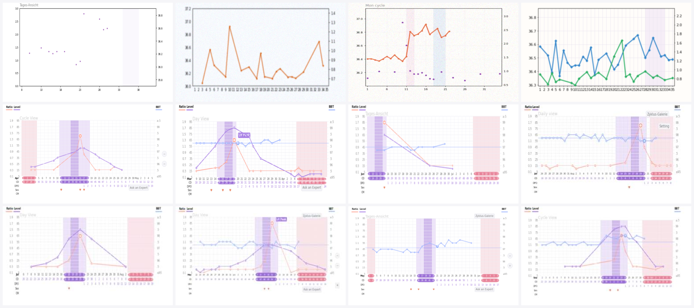

# FertiLuna models

This package trains and exports the two on-device models used by the FertiLuna
Astro app. Both run **client-side** in the browser via ONNX Runtime Web (WASM).

| Model | Package | Task | Size |
|-------|---------|------|------|
| **Cycle classifier** | `fertiluna/` | features -> cycle label (5 classes) + anomaly score | ~5.6 MB |
| **Chart-vision** | `fertiluna_vision/` | chart *screenshot* -> per-day BBT + LH series | ~19 MB |

---

# 1. Chart-vision model

## 1.1 Problem statement

Users track their cycle in third-party apps (primarily **Premom**) and paste a
**screenshot** of the chart. The goal is to *digitize* that screenshot, recover,
for each cycle day, the basal body temperature (BBT) and the LH test value
so the cycle classifier can run without the user manually clicking every point
and calibrating both axes. The model resolves the chart at a fixed temporal
resolution of `N_DAYS = 35` and emits two series, `[temp, lh]`.

Because the absolute y-scales differ per app and per screenshot, the model
predicts values **normalized to [0, 1] within each series' own axis range**. The
browser then asks the user only for each axis' min/max to de-normalize a far
smaller interaction surface than full manual calibration (TODO: this step can also be computed in the future through a small OpenCV model / or a small DL model)

## 1.2 Synthetic data

No public BBT/LH chart-image dataset exists at scale, and real screenshots are
unlabeled. We therefore **render our own charts** from a physiologically-grounded
cycle generator, which gives us exact, free labels for every pixel we draw.

**Signal generation** (`fertiluna/synthetic.py`). One cycle is sampled from five
physiological archetypes (normal, doubtful, short-luteal, anovulatory,
insufficient) with realistic follicular baseline, pre-ovulatory nadir, a 1–3 day
thermal rise, a luteal plateau, plus artifacts (fever spikes, late-measurement
noise, missing days). The LH signal carries a surge 1–2 days before ovulation,
with optional spurious peaks (PCOS-like).

**Chart rendering** (`fertiluna_vision/render.py`, matplotlib `Agg`). Two
renderers produce the training images:

- **Generic** : randomized dual-axis line charts (random colors, fonts, DPI,
  gridlines, fertile-window bands, markers, missing data, blur/JPEG noise). Broad
  visual coverage so the model generalizes beyond any single app.
- **Premom** : a high-fidelity reproduction of the Premom app layout: three
  y-axes (`Ratio | Level | BBT`), blue BBT line (right axis), a spiky orange
  "Ratio" LH line (left axis, the predicted `lh`), a purple "Level" distractor
  line (middle axis, *not* labeled), violet fertile-window / pink period bands,
  per-run rounded date capsules, calendar / cycle-day / DPO rows with month and
  cycle rollover, Celsius **and** Fahrenheit BBT scales (with the app's
  `≥/≤`-prefixed extreme labels and half-step gridlines), the characteristic
  `+`/"LH Peak" marker, the "B" coverline marker, and floating UI chrome the
  model must learn to ignore. Plotted points are **snapped to gridlines** and
  **cell-centered**, matching the real app exactly.

Crucially, every plotted point is quantized to the same grid the label is read
from, so the regression target matches the rendered pixels to ~1e-8.

Sample of the rendered distribution (top row: generic; lower rows: Premom):



## 1.3 Network architecture

A compact, fully-convolutional encoder maps the RGB chart to a feature map that
is collapsed along **height** and resampled along **width** to exactly `N_DAYS`
columns, encoding the inductive bias *"read the curve column by column"*.

```
input  [B, 3, 224, 384]   (ImageNet-normalized NCHW)
  stem            Conv-BN-ReLU6, stride 2                 -> /2
  blocks          7× depthwise-separable (MobileNet-style), strides 2,2,2 -> /16
  height pool     mean over H                              -> [B, C, W']
  width refine    depthwise Conv1d + pointwise Conv1d
  resample        linear interpolate W' -> N_DAYS
  ├─ value head   Conv1d -> [B, 2, 35]   (raw logits -> sigmoid = normalized value)
  └─ present head Conv1d -> [B, 2, 35]   (raw logits -> sigmoid = P(point exists))
```

- **Depthwise-separable convs** keep it small (`width=3.0` -> **4.73 M params**,
  ~19 MB ONNX) and WASM-friendly: no attention, no dynamic shapes -> clean export.
- **Two heads** decouple *where* a point exists (`present`) from *its value*
  (`value`), so absent days aren't penalized for their (undefined) value.
- Height-collapse uses `mean` (equivalent to adaptive average pooling over the
  fixed height) specifically so the graph exports to a single static ONNX.

## 1.4 Training objective

Per (series, day) cell:

- **Presence** : `BCEWithLogits` over all cells.
- **Value** : Huber (smooth-L1, β=0.05) on `sigmoid(value_logit)`, **masked** to
  cells where a point is actually present.

Total loss `= 5·value + 1·presence`. Optimizer AdamW + OneCycleLR; mixed
precision (AMP) on CUDA. Best weights are checkpointed on every validation
improvement, so a crash never loses the model.

**Metrics** (on a held-out synthetic val set):

- `val_mae_present` : mean absolute error of the *normalized* value on present
  days (1.0 = full axis span).
- `val_presence_f1` : F1 of presence detection.

## 1.5 Two-stage curriculum (pre-train -> fine-tune)

We train in two stages, the standard sim-to-real recipe:

1. **Pre-train** a general chart reader on a large generic set (≈100 k charts,
   40 epochs). Reaches `val_mae ≈ 0.0225`.
2. **Fine-tune** on a **blended** set (70 % Premom + 30 % generic) initialized
   from the pre-trained weights at a low learning rate (`2e-4`, 15 epochs). This
   retargets the model to the Premom layout without forgetting other apps.

**v1 fine-tune results** (5 k blended val set, `width=3.0`):

| metric | value |
|--------|-------|
| params | 4.73 M |
| ONNX size | 18.89 MB |
| `val_mae_present` | **0.0238** (≈ 2.4 % of axis span) |
| presence F1 | **0.9428** |
| torch↔onnxruntime parity | ≤ 6e-4 max abs |

> **Caveat.** These metrics are on *synthetic* Premom-style charts. They do not
> directly measure the sim-to-real gap on actual screenshots. That should be
> validated separately on a sample of real captures before relying on the model
> in production.

## 1.6 Reproducing v1

```bash
cd model
python3.12 -m venv .venv
.venv/bin/python -m pip install -e ".[vision]" pytest
# CUDA GPU (recommended): install the CUDA torch wheel
.venv/bin/python -m pip install --upgrade "torch>=2.2" --index-url https://download.pytorch.org/whl/cu121

# Stage 1 — pre-train the general reader (large generic set; ~hours on a GPU)
.venv/bin/python -m scripts.build_vision_dataset --out data --n 100000 --seed 1  --workers 16
.venv/bin/python -m scripts.build_vision_dataset --out data --n 10000  --seed 99 --workers 16
.venv/bin/python -m scripts.train_and_export_vision \
    --train-npz data/charts-generic-100000-seed1 --val-npz data/charts-generic-10000-seed99 \
    --width 3.0 --epochs 40 --batch-size 32 --num-workers 16 --out artifacts --version base
cp artifacts/chart-vision-base.ckpt artifacts/chart-vision-base-synthetic.ckpt

# Stage 2 — fine-tune on Premom-blended data from the pre-trained weights
.venv/bin/python -m scripts.build_vision_dataset --out data --n 40000 --seed 1  --workers 16 --style blend
.venv/bin/python -m scripts.build_vision_dataset --out data --n 5000  --seed 99 --workers 16 --style blend
PYTORCH_CUDA_ALLOC_CONF=expandable_segments:True \
.venv/bin/python -m scripts.train_and_export_vision \
    --train-npz data/charts-blend-40000-seed1 --val-npz data/charts-blend-5000-seed99 \
    --width 3.0 --epochs 15 --batch-size 32 --num-workers 16 \
    --lr 2e-4 --init-ckpt artifacts/chart-vision-base-synthetic.ckpt \
    --out artifacts --version v1
```

Notes:
- **Memory.** Datasets are streamed to disk as memory-mapped `.npy` directories
  (`build_vision_dataset.py`, `--chunk`) and loaded with `mmap_mode='r'`, so
  neither rendering nor training holds the full (≈31 GB for 120 k) set in RAM.
- **8 GB VRAM** fits `width=3.0` at `--batch-size 32`. Use
  `PYTORCH_CUDA_ALLOC_CONF=expandable_segments:True` to avoid fragmentation.
- Recover ONNX from a checkpoint with `scripts.export_vision_from_ckpt`.
- Inspect the renderer at high resolution:
  `python -m scripts.preview_premom_render --out /tmp/p.png --dpi 300`.

## 1.7 ONNX I/O contract (the browser must match)

| input | outputs |
|-------|---------|
| `image` float32 `[N, 3, 224, 384]` (ImageNet-normalized NCHW) | `value` `[N, 2, 35]`, `present` `[N, 2, 35]` — both **raw logits** (apply `sigmoid` in the browser). Series order `[temp, lh]`. |

---

# 2. Cycle classifier

A Random Forest that labels a cycle from extracted features (ovulation confirmée
/ douteuse / anovulation / phase lutéale courte / données insuffisantes), with an
Isolation Forest anomaly backstop.

```bash
cd model
.venv/bin/python -m scripts.train_and_export --out artifacts --n-samples 50000 --version v1
```

Outputs: `cycle-classifier-v1.onnx` (~5.6 MB, single calibrated forest),
`cycle-iforest-v1.onnx` (~1.3 MB anomaly backstop), `model-manifest-v1.json`,
`feature-fixtures.json` (TS parity fixtures).

**Design choices.**
- *Why synthetic data:* the "ground truth" for cycle classification is itself a
  deterministic rule (SENSIPLAN 3-over-6). Physiologically-grounded generation
  with realistic noise gives a tractable supervised target with full edge-case
  coverage.
- *Why Random Forest:* interpretable, NaN-robust, exports cleanly to ONNX,
  ~5 ms in-browser inference.
- *Why a single prefit-calibrated forest:* `CalibratedClassifierCV(cv=5)`
  serializes five forests to a ~250 MB ONNX. We instead train ONE forest on a fit
  split and fit Platt scaling on a held-out split (`FrozenEstimator`) -> ~5.6 MB
  at ~89 % accuracy.
- *Why Platt calibration:* raw RF probabilities saturate toward 0/1; sigmoid
  calibration makes the "< 0.6 → données insuffisantes" gate statistically
  honest.
- *Why an Isolation Forest backstop:* the classifier always outputs *some* class;
  the iforest score flags feature vectors far from anything seen in training.

| Model | input | outputs |
|-------|-------|---------|
| classifier | `input` float32 `[N, 30]` | `label` `[N]`, `probabilities` `[N, 5]` |
| iforest | `input` float32 `[N, 30]` | `label` `[N, 1]`, `scores` `[N, 1]` (negative ⇒ anomalous) |

---

## Repository layout

```
fertiluna/                 # cycle classifier
  constants.py     # CYCLE_MAX_DAYS, LABELS, FEATURE_NAMES — synced with src/lib/constants.ts
  synthetic.py     # physiologically-grounded cycle generator (5 archetypes)
  features.py      # NaN-safe feature extraction; canonical implementation
  train.py         # RF + Platt calibration + Isolation Forest backstop
  export_onnx.py   # sklearn → ONNX + manifest with checksums
fertiluna_vision/          # chart-screenshot → per-day series
  constants.py     # IMG_H/IMG_W, N_DAYS, N_SERIES — synced with src/lib/visionInference.ts
  synthetic*       # (reused from fertiluna/) physiological signal generation
  render.py        # generic + Premom synthetic chart renderers
  dataset.py       # torch Dataset (on-the-fly) + memmap-backed cached dataset
  model.py         # compact depthwise-separable CNN, value + presence heads
  train.py         # masked losses, CUDA/AMP, fine-tuning (--init-ckpt, freeze)
  export_onnx.py   # torch → single-file ONNX + manifest + parity check
scripts/
  train_and_export.py            # cycle classifier
  build_vision_dataset.py        # pre-render charts to memmap .npy (generic/premom/blend)
  train_and_export_vision.py     # vision model train + export (see header for recipe)
  export_vision_from_ckpt.py     # recover ONNX from a checkpoint
  preview_premom_render.py       # dump a random chart PNG to inspect the renderer
docs/              # README assets (dataset preview)
artifacts/         # trained .ckpt / .onnx / manifests (version-controlled)
data/              # gitignored; pre-rendered chart datasets (memmap .npy dirs)
tests/
```

## Browser parity contract

`fertiluna/features.py` and `src/lib/features.ts` MUST produce identical output
for the same inputs. The `feature-fixtures.json` artifact lets the TypeScript
test in the Astro project verify parity. The chart-vision preprocessing
(resize -> ImageNet normalize -> NCHW) must match `src/lib/visionInference.ts`.

The trained model artifacts are copied into the Astro app's `public/models/`
directory to be served as Worker static assets and cached client-side in
IndexedDB (DexieJS). See `../README.md` for the export -> browser wiring.
